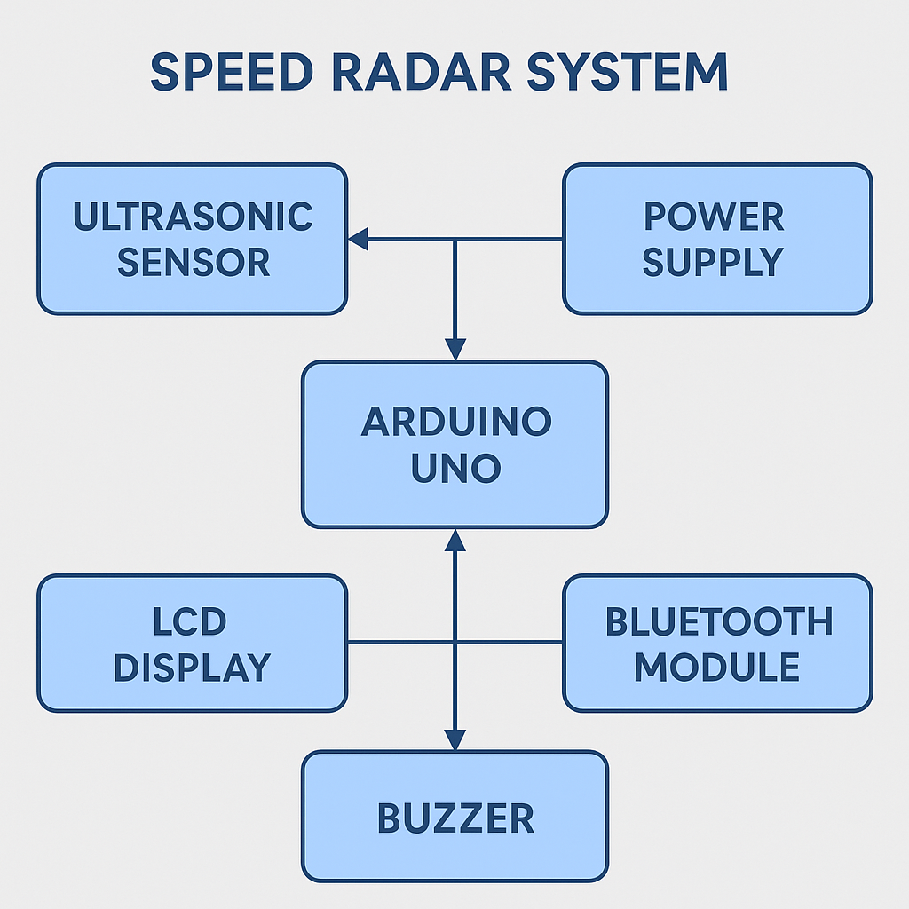
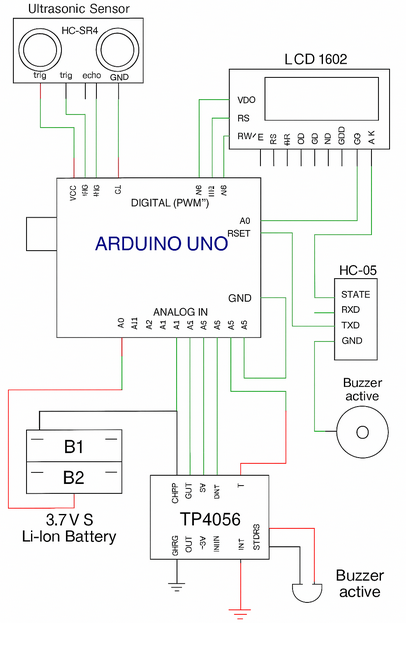

# **Radar de Vitesse avec Arduino**

## Auteur
Banu Andreea

## Description
Ce projet consiste à construire un radar de vitesse basé sur la plateforme Arduino, capable de mesurer la vitesse des objets en mouvement à l'aide de capteurs à ultrasons HC-SR04. Les résultats sont affichés sur un écran LCD 1602, et les données peuvent également être transmises via un module Bluetooth HC-05.
## Motivation
La gestion de la vitesse est essentielle dans divers contextes, notamment pour contrôler la vitesse des véhicules dans des zones spécifiques ou pour mesurer la rapidité d'objets en mouvement. Ce projet vise à développer un radar de vitesse simple et portable en utilisant une carte Arduino Uno R3 et des composants compatibles.

## Architecture
**Carte de développement Arduino UNO R3 (ATmega328p + ATmega16u2)**

    Cœur du projet, assure la gestion des capteurs et l'affichage des données.

**Capteur Ultrasonique HC-SR04 (2 unités)**

    Mesure la distance des objets en mouvement.

    Permet de calculer la vitesse en fonction du temps de passage entre les capteurs.

**Afficheur LCD 1602 avec rétroéclairage bleu**

    Affiche la vitesse en km/h ou m/s.

    Connexion via interface I2C pour simplifier les branchements.

**Module Bluetooth HC-05 (3.3V et 5V compatible)**

    Transmet les données de vitesse à un smartphone ou à un ordinateur.

    Permet la surveillance en temps réel via une application mobile.

**Buzzer Actif 5V (12 mm x 10 mm)**

    Alerte sonore lorsque la vitesse dépasse une limite prédéfinie.

**Plaque d'essai Breadboard 830 points (MB102)**

    Permet de réaliser les connexions sans soudure.

**Module de Chargement TP4056 (1A) avec Micro USB**

    Assure la recharge des batteries Li-Ion en toute sécurité.

    Protection contre la surcharge et la décharge excessive.

**Boîtier pour 2 batteries 18650**

    Maintient les batteries en place et permet une connexion sécurisée.

**Jeu de fils de liaison rigides pour Breadboard**

    Permet de relier facilement les composants sur la plaque d'essai.

**Batteries Lithium-Ion (2 x 18650, 3.7V chacune)**
### Diagramme en Blocs

<!-- Make sure the path to the picture is correct -->

```
[ Capteur Ultrasonique HC-SR04 ]   [ Capteur Ultrasonique HC-SR04 ]
           |                                   |
           +-------------------------+---------+
                                     |
                [ Arduino UNO R3 (Microcontrôleur) ]
                                     |
              +------------+---------+------------+
              |            |                      |
      [ LCD 1602 ]    [ Module Bluetooth HC-05 ]   [ Buzzer ]
              |
   [ Batteries Li-Ion 18650 + Module TP4056 ]
   ```

### Schéma Électrique




### Composants


<!-- This is just an example, fill in with your actual components -->

| Device | Usage | Price |
|--------|--------|-------|
| Arduino UNO R3 (ATmega328p + ATmega16u2) | Contrôleur principal | [50 RON](https://www.optimusdigital.ro/en/avr-boards/1685-development-board-compatible-with-arduino-uno-r3-atmega328p-atmega16u2.html?search_query=Development+Board+Compatible+with+Arduino+UNO+R3+%28ATmega328p+++ATmega16u2%29&results=2) |
| Capteur Ultrasonique HC-SR04  | Mesure de la distance | [25 RON](https://www.emag.ro/senzor-ultrasonic-hc-sr04-3/pd/D3NL48YBM/?utm_source=cns_delivery&utm_medium=email&utm_campaign=cns_delivery_order&utm_content=cns_product_title&ref_id=1798362454) |
| Afficheur LCD 1602 avec rétroéclairage bleu | Affichage  | [14 RON](https://www.optimusdigital.ro/en/lcds/94-1602-lcd-with-blue-backlight.html?search_query=1602+LCD+with+Blue+Backlight&results=6) |
| Module Bluetooth HC-05 (3.3V et 5V compatible) |Communication sans fil | [28 RON](https://www.optimusdigital.ro/en/wireless-bluetooth/153-hc-05-master-slave-bluetooth-module-with-adapter-33v-and-5v-compatible.html?search_query=HC-05+Master+Slave+Bluetooth+Module+with+Adapter+%283.3+V+and+5+V+Compatible%29&results=2) |
| Buzzer Actif 5V | Alerte sonore | [7 RON](https://www.emag.ro/buzzer-activ-5v-12mm-x-10mm-ai0151-s126/pd/DTPXQGMBM/?utm_source=cns_delivery&utm_medium=email&utm_campaign=cns_delivery_order&utm_content=cns_product_title&ref_id=1798359517) |
| Plaque de prototypage Breadboard (830 points) | Connexion | [10 RON](https://www.emag.ro/senzor-ultrasonic-hc-sr04-3/pd/D3NL48YBM/?utm_source=cns_delivery&utm_medium=email&utm_campaign=cns_delivery_order&utm_content=cns_product_title&ref_id=1798362454) |
| Module de charge TP4056 | Recharge  | [10 RON](https://www.emag.ro/modul-incarcare-baterii-litiu-1a-tp4056-cl29/pd/DTZZ5JBBM/?utm_source=cns_delivery&utm_medium=email&utm_campaign=cns_delivery_order&utm_content=cns_product_title&ref_id=1798206726) |
| Support de batteries 2 x 18650 | Montage batteries | [4 RON](https://www.optimusdigital.ro/en/battery-holders/941-2x18650-battery-case.html?search_query=+2+x+18650+Battery+Case+%09+&results=28) |
| Batteries Li-Ion 18650 (2 x 3.7V, 1200mAh) | Source d'alimentation  | [16 RON](https://www.emag.ro/acumulator-18650-li-ion-3-7v-1200mah-albastru-ddcelsag130-21013/pd/DDNVBFMBM/) |
| Jeu de fils de liaison (jumper) | Connexion  | [13 RON](https://www.optimusdigital.ro/en/wires-without-connectors/899-set-de-fire-pentru-breadboard-rigide.html?search_query=Rigid+Breadboard+Jumper+Wire+Set&results=1) |
| **Total**           |                                     | **177 RON**    |

### Bibliothèques Utilisées

<!-- This is just an example, fill in the table with your actual components -->

| Bibliothèque            | Description                                      | Utilisation                            |
|-------------------------|--------------------------------------------------|----------------------------------------|
| Wire.h                  | Communication I2C standard                       | Pour l'afficheur LCD 1602 en mode I2C          |
| LiquidCrystal_I2C.h            | Contrôle simplifié de l'afficheur LCD I2C                 | Affichage de la vitesse en temps réel           |
| SoftwareSerial.h        | 	Communication série supplémentaire                   | Communication avec le module Bluetooth HC-05                  |
| NewPing.h                 | Gestion des capteurs ultrasoniques HC-SR04               | Mesure de la distance pour calculer la vitesse             |
| Tone.h      | Génération de sons (buzzer)                  | Alerte sonore si la vitesse dépasse la limite             |
| EEPROM.h       | Stockage des paramètres utilisateur                  | Sauvegarde de la vitesse maximale autorisée     |


## Journal de Bord

<!-- write every week your progress here -->

| Semaine               | Activités réalisées                                 |
|-----------------------|-----------------------------------------------------|
| Semaine 6 - 12 Mai    | Identification de l'idée de projet, recherche sur les capteurs adaptés et les composants nécessaires  |
| Semaine 7 - 19 Mai    | Sélection des composants et comparaison des options en ligne, rédaction de la documentation, liste des composants et schéma électrique, rédaction du code (un et deux capteurs HC-SR04) |
| Semaine 18 - 26 Mai    | Finalisation de la documentation, tests des capteurs et ajustements du code, préparation de la présentation du projet |


## Liens de Référence

<!-- Fill in with appropriate links and link titles -->

[Projet de Radar avec Arduino](https://www.instructables.com/Arduino-Ultrasonic-Radar-Project/)

[Tutoriel sur l'Écran LCD I2C avec Arduino](https://arduinogetstarted.com/tutorials/arduino-lcd-i2c)

[Connexion Facile du Module HC-05 avec Arduino](https://www.instructables.com/Arduino-AND-Bluetooth-HC-05-Connecting-easily/)
